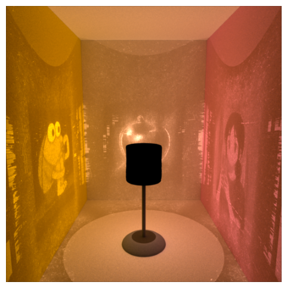

# Caustic Projection Lamp: A Lamp That Is More Lamp


*Teaser: Example of the final rendered caustic projection (see notebook for details)*

**Authors:** Evan Zhang, Carrie Wang

## Overview
This project implements a caustic projection lamp using differentiable rendering. The goal is to optimize a lens shape so that, when illuminated, it projects specific images (caustics) onto surfaces. The process uses Mitsuba 3, Dr.Jit, and custom scene/mesh files.

## Directory Structure
```
.
├── 4197_Final_Caustics.ipynb           # Main notebook for the project
├── scenes/
│   ├── references/                     # Reference images for caustic targets
│   │   ├── apple.png
│   │   ├── comic.png
│   │   └── daidai.png
│   └── meshes/                         # Mesh files for scene objects
│       ├── lamp_base.obj
│       ├── lamp.obj
│       ├── lamp_out.obj
│       └── rectangle.obj
├── outputs/                            # Output directory for results
│   └── example/
│       ├── lens_displaced.ply          # Optimized lens mesh (large file)
│       ├── lens_1024_2048.ply          # Intermediate lens mesh
│       ├── lens_512_5120.ply           # Intermediate lens mesh
│       ├── optimisation.gif            # Optimization progress animation
│       ├── out_ref.exr                 # Reference image (EXR)
│       └── heightmap_final.exr         # Final heightmap (EXR)
```

## Requirements
- Python 3.8+
- [Mitsuba 3](https://mitsuba-renderer.org/)
- drjit
- numpy
- matplotlib
- (Optional) imageio, tqdm, and other common scientific Python packages

### Installing Mitsuba 3
Mitsuba 3 is a research renderer and must be installed following the [official instructions](https://mitsuba-renderer.org/download.html). It requires a CUDA-capable GPU for the `cuda_ad_rgb` variant used in this project. 

**Example (conda):**
```
conda create -n mitsuba3 python=3.9
conda activate mitsuba3
pip install drjit numpy matplotlib
# Download and install Mitsuba 3 following the official guide
```

## Data Files
- Reference images: `scenes/references/apple.png`, `comic.png`, `daidai.png`
- Meshes: `scenes/meshes/lamp.obj`, `lamp_base.obj`, `lamp_out.obj`, `rectangle.obj`

## How to Reproduce the Results
1. **Install all dependencies** as described above, ensuring Mitsuba 3 is working and the `cuda_ad_rgb` variant is available.
2. **Clone or copy this repository** and ensure the directory structure matches the above.
3. **Download or generate the required mesh and reference image files** (provided in the repository).
4. **Open `4197_Final_Caustics.ipynb`** in Jupyter or your preferred notebook environment.
5. **Run all cells in order.**
    - The notebook will:
        - Set up the scene and load reference images
        - Generate or load the cylindrical lens mesh
        - Run the optimization loop to adjust the lens shape
        - Save intermediate and final results in the `outputs/example/` directory
        - Produce visualizations and GIFs of the optimization process
6. **Check the outputs** in the `outputs/example/` directory. The main results are the optimized lens mesh (`lens_displaced.ply`) and the optimization progress GIF (`optimisation.gif`).

## How to Change the Reference Images

If you want to use your own images as caustic projection targets:
1. **Prepare your new reference images** (preferably PNG format, and similar in size to the originals for best results).
2. **Place your images in the `scenes/references/` directory.**
3. **Edit the notebook configuration:**
   - In the notebook, locate the section where the `CONFIGS` dictionary is defined (look for keys like `'reference_front'`, `'reference_wall'`, and `'reference_left'`).
   - Change the file names/paths to point to your new images, e.g.:
     ```python
     'reference_front': join(SCENE_DIR, 'references/my_new_image.png'),
     'reference_wall':  join(SCENE_DIR, 'references/my_wall_image.png'),
     'reference_left':  join(SCENE_DIR, 'references/my_left_image.png'),
     ```
4. **Save and rerun the notebook.**

The optimization will now use your new images as the caustic targets.

## Notes
- The optimization process is computationally intensive and requires a CUDA-capable GPU.
- Output files (especially `.ply` meshes) can be very large (multiple GBs).
- You may adjust parameters (resolution, iterations, etc.) in the notebook for faster or higher-quality results.
- For troubleshooting Mitsuba 3 installation, refer to the [official documentation](https://mitsuba-renderer.org/documentation.html).